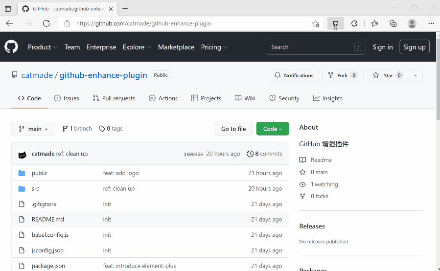

# github-enhance

GitHub 增强插件修改了 GitHub 的一些功能来提升浏览体验，目前实现的功能有：

- 固定页面头部
- 固定仓库头部

## 功能演示




## 使用

> 由于浏览器的安全限制，无法直接安装第三分插件，需要在“插件管理”中启用”开发人员模式“。  
> 如果不启用该模式，安装时会报错：`包无效:"CRX_REQUIRED_PROOF_MISSING"`

启用“开发人员模式”后，下载 [release](https://github.com/catmade/github-enhance-plugin/release) 中发布的安装包或者下载源码自己手动编译，然后将文件拖到浏览器中即可安装。

## 编译并打包

```ruby
git clone --depth=1 https://github.com/catmade/github-enhance-plugin
cd https://github.com/catmade/github-enhance-plugin

yarn install  # project setup
yarn build    # compile
```

编译完成后，会在当前目录下生成 `dist` 目录，使用浏览器的“打包扩展程序”功能打包该目录即可生成 `crx` 插件文件

> 打包教程参考：https://zhuanlan.zhihu.com/p/103420650
